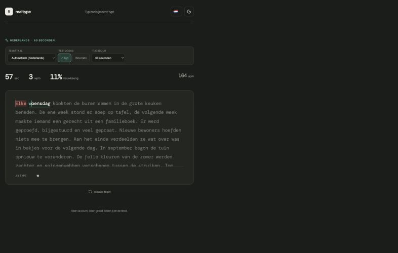
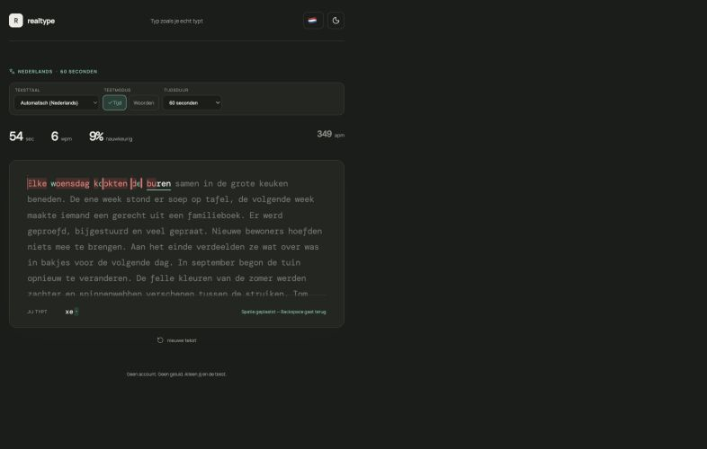

# RealType

[](https://bjornb2.github.io/realtype/)

Een rustige, realistische typing test die je laat typen zoals je dat in het dagelijks leven doet. Fouten blokkeren de invoer niet en de tekst blijft altijd op zijn plaats.

**[Open de live typing test](https://bjornb2.github.io/realtype/)**



## Waarom RealType?

Veel typing tests raken binnen een woord uit synchronisatie zodra je een letter overslaat of te veel typt. RealType lijnt de volgende herkenbare letters opnieuw uit. Daardoor zie je waar de fout zit en kun je gewoon verder typen.

- Samenhangende, willekeurig gekozen Nederlandse en Engelse teksten
- Iedere test begint aan het begin van een zin
- Tekst- en interfacetaal volgen standaard de browser
- Teksttaal kan afzonderlijk worden overschreven
- Testduur van 15, 30, 60 of 120 seconden
- Woordtests van 10 tot en met 500 woorden, inclusief een eigen lengte
- Live WPM, aanslagen per minuut en nauwkeurigheid
- Automatische light en dark mode met handmatige override
- Geen account, tracking of geluid

## Hoe woordinvoer werkt

Een spatie zet het huidige woord voorlopig klaar. Met Backspace kun je de spatie nog verwijderen en het woord verbeteren. Het woord wordt pas definitief beoordeeld wanneer je de eerste letter van het volgende woord typt.



## Lokaal ontwikkelen

```bash
npm install
npm run dev
```

Controles uitvoeren:

```bash
npm run lint
npm test
npm run build
```

Elke push naar `main` wordt met GitHub Actions automatisch getest, gebouwd en gepubliceerd naar GitHub Pages.

## Licentie

De broncode is publiek beschikbaar onder de [PolyForm Noncommercial License 1.0.0](LICENSE.md). Niet-commercieel gebruik, aanpassen en delen is toegestaan volgens die voorwaarden. Voor commercieel gebruik is afzonderlijke schriftelijke toestemming nodig.
